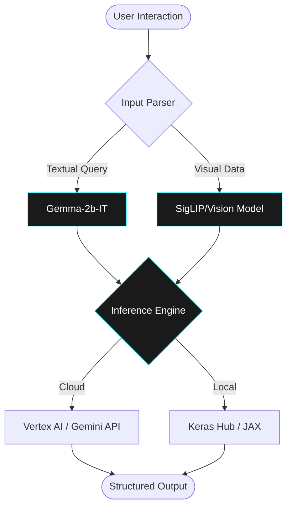

<!-- STRICTLY PROFESSIONAL GITHUB PROFILE README -->
<!-- Author: Jibitesh Kumar Mishra -->
<!-- Focus: AI Research & Software Engineering -->

  

  

  
  
  
  

---

## PROFESSIONAL_SUMMARY: RESEARCH_PROFILE

> **STATEMENT**: Final-year Computer Science & Engineering student at Silicon University. Architecting intelligent systems at the intersection of **Artificial Intelligence** and **Scalable Software Engineering**. Focused on bridging the gap between theoretical research and production-grade implementation.

### TECHNICAL_OBJECTIVES
- **Algorithm Optimization:** Intensive research into Data Structures and Complexity Analysis for high-performance computing.
- **Generative AI:** Investigating multimodal inference optimization and agentic workflows in LLMs.
- **System Design:** Implementing modular, maintainable architectures following SOLID and Clean Code principles.

---

## ENGINEERING_METHODOLOGY (SDLC)

Standardized approach to software development, ensuring rigorous quality control and maintainability.

---

## TECHNICAL_STACK_&_INSTRUMENTATION

<table width="100%">
  <tr>
    <td width="50%" valign="top">
      <h3>CORE_LANGUAGES</h3>
      
      
    </td>
    <td width="50%" valign="top">
      <h3>AI_&_DATA_SCIENCE</h3>
      
      
      
      
    </td>
  </tr>
  <tr>
    <td width="50%" valign="top">
      <h3>CS_FUNDAMENTALS</h3>
      
      
      
      
    </td>
    <td width="50%" valign="top">
      <h3>DEVOPS_&_TOOLS</h3>
      
      
      
    </td>
  </tr>
</table>

---

## FEATURED_PROJECT: GemmaX ChatCore

**Multimodal Framework for Advanced AI Inference & Experimentation**

### Technical Implementation Details
- **Hybrid Inference Orchestration:** Developed a dual-backend system facilitating seamless switching between local JAX-based execution and cloud-hosted API integration.
- **Multimodal Feature Extraction:** Engineered vision-language bridging for concurrent processing of high-dimensional image and text vector spaces.
- **Context Preservation:** Implemented a robust state-management module for persistent conversation history across multi-turn inference sessions.

**TECHNOLOGIES:** `Python` `Gemma` `JAX` `Keras Hub` `Google GenAI API`

[**Source Repository →**](https://github.com/jibitesh-auth/GemmaX_ChatCore)

---

## SYSTEM_METRICS

  

  

---

  <h3>CONTRIBUTION_TIMELINE</h3>
  <picture>
    <source media="(prefers-color-scheme: dark)" srcset="https://github.com/jibitesh-auth/jibitesh-auth/blob/output/github-contribution-grid-snake-dark.svg" />
    <source media="(prefers-color-scheme: light)" srcset="https://github.com/jibitesh-auth/jibitesh-auth/blob/output/github-contribution-grid-snake.svg" />
    
  </picture>

---

  <i>
    "The most important property of a program is whether it accomplishes the intention of its user."
  </i>
   
  — C.A.R. Hoare

  

